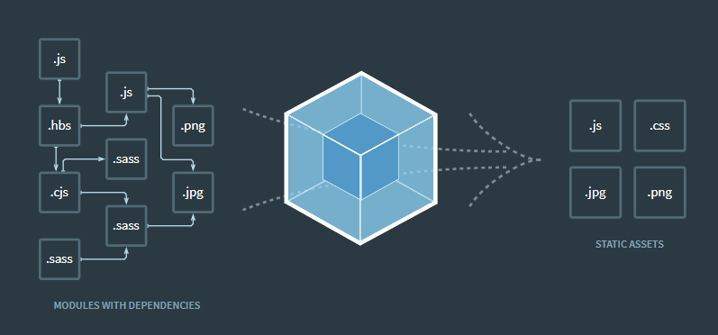

## 前端工程化工具比较

随着web2.0的发展， 前端技术发展迅速, 各种可以提高开发效率的新思想和框架被发明, 但是这些工具都需要通过转换后才能正常运行. 构建包含以下内容:

- **代码转换**: TypeScript 编译成JavaScript,SCSS 编译成 CSS 等
- **文件优化**: 压缩 JavaScript/CSS/HTML等静态资源
- **代码分割**: 提取多个页面的公共代码, 提取首屏不需要执行部分的代码让其异步加载
- **模块合并**: 在采用模块化的项目里会有很多个模块和文件, 需要构建功能把模块分类合并成一个文件
- **自动刷新**: 监听本地资源代码的变化, 自动重新构建刷新浏览器
- **代码校验**: 在代码被提交到仓库前需要校验代码是否符合规范, 以及单元测试是否通过
- **自动发布**: 更新完代码后, 自动构建出线上发布代码并传输给发布系统

接下来是前端工程构建出现一系列的构建工具:

### Grunt

[Grunt](https://gruntjs.com)是一个任务执行者. 拥有大量线程的插件封装了常见的任务, 也能管理任务之间的依赖关系, 自动化执行依赖的任务.

```js
// demo
module.exports = function (grunt) {
  // 所有插件的配置信息
  grunt.initConfig({
    // uglify 插件的配置信息
    uglify: {
      app_task: {
        files: {
          'build/app.min.js': ['lib/index.js', 'lib/test.js']
        }
      }
    },
    // watch 插件的配置信息
    watch: {
      another: {
        files: ['lib/*.js]
      }
    }
  })

  // 告知 grunt 我们要用的插件
  grunt.loadNpmTasks('grunt-contrib-uglify')
  grunt.loadNpmTasks('grunt-contrib-watch')

  // 告诉 grunt 我们要执行的任务
  grunt.registerTask('dev', ['uglify', 'watch'])
}
```

优点: 

- 灵活, 只负责执行你定义的任务
- 大量的可复用插件封装好了常见的构建任务

缺点: 

- 集成度不高, 无法做到开箱即用

> Grunt 相当于进化版的 Npm Script, 它的诞生是为了弥补 Npm Script 的不足

### Gulp

[Gulp](http://gulpjs.com/)是一个基于流的自动化构建工具. 除了可以管理和执行任务, 还支持监听文件, 读写文件. 常用的5个方法(几乎适合所有构建场景):

- `gulp.task`注册一个任务
- `gulp.run`执行任务
- `gulp.watch`监听文件变化
- `gulp.src`读取文件
- `gulp.dest`写文件

```js
// demo
var gulp = require('gulp')
// plugins
var jshint = require('gulp-jshint')
var sass = require('gulp-sass')
var concat = require('gulp-concat')
var uglify = require('gulp-uglify')

// 编译 SCSS 任务
gulp.task('sass', function() {
  // 读取文件通过管道喂给插件
  gulp.src('./scss/*.scss')
    // SCSS 编译 CSS
    .pipe(sass())
    // 输出文件
    .pipe(gulp.dest('./css))
})

// 合并压缩 JS
gulp.task('scripts', function() {
  gulp.src('./js/*.js')
    .pipe(concat('all.js))
    .pipe(uglify())
    .pipe(gulp.dest('./dist'))
})

// 监听文件变化
gulp.task('watch', function() {
  // 当 SCSS 文件被编辑时执行 SCSS 任务
  gulp.watch('./scss/*.scss', ['sass'])
  gulp.watch('./js/*.js', ['scripts'])
})
```

优点:

- 好用又不是灵活, 既可以单独完成构建也可以和其他工具搭配使用

缺点:

- 集成度不高, 需要写很多配置后才能使用, 无法做到开箱即用

> NOTES: 可以将 Gulp 看作 Grunt 的增强版版. 相比较下增加了监听文件, 读写文件, 流式处理的功能

### Fis3

[Fis3](https://fis.baidu.com/) 是来自百度的优秀国产构建工具. 相对于 Grunt, Gulp 这些只提供基本功能的工具, Fis3集成了Web开发中常用构建功能

- **读写文件**: 通过 `fis.match`读文件, `relase` 配置文件输出路径
- **资源定位**: 解析文件之间的依赖关系和文件位置 
- **文件指纹**: 通过`useHash`配置输出文件时给文件URL加上md5戳来优化浏览器缓存
- **文件编译**: 通过`parser`配置文件解析器做文件转换, 例如 ES6 => ES5
- **压缩资源**: 通过`optimizer`配置代码压缩方法
- **图片文件**: 通过`spriter`配置合并CSS里导入的图片到一个文件来减少HTTP请求数

```js
// md5
fis.match('*.{js,css,png}', {
  useHash: true
})

// fis-parser-typescript 插件编译 TypeScript => JavaScript
fis.match('*.ts', {
  parser: fis.plugin('typescript')
})

// 对 CSS进行雪碧图合并
fis.match('*.css', {
  // 给匹配到的文件分配属性`useSprite`
  useSprite: true
})

// 压缩JavaScript
fis.match('*.js', {
  optimizer: fis.plugin('uglify-js')
})

// 压缩 CSS
fis.match('*.css', {
  optimizer: fis.plugin('clean-css')
})

// 压缩图片
fis.match('*.png', {
  optimizer: fis.plugin('png-compressor')
})
```

优点:

- 集成了各种Web开发所需的构建功能, 配置简单开箱即用

缺点:

- 目前官方不再更新维护, 不支持最新版本的Nodejs

> NOTES: Fis3是一种专注与Web开发的完整解决方案

### Webpack

[Webpack](https://webpack.js.org/)是一个打包模块化JavaScript的工具, 在Webpack里一切文件皆模块, 通过Loader转换文件, 通过Plugin注入钩子, 最后输出多个模块组合的文件. Webpack专注于构建模块化项目



```js
// demo
module.exports = {
  // 所有模块的入口, Webpack从入口开始递归解析出所有依赖的模块
  entry: './app.js',
  output: {
    // 把入口所依赖的所有模块打包成一个文件 bundle.js 输出
    filename: 'bundle.js'
  }
}
```

优点:

- 专注于处理模块化的项目, 能做到开箱即用一步到位
- 通过 `Plugin` 扩展, 完整好用又不是灵活
- 使用场景不仅限于 Web 开发
- 社区庞大且活跃, 经常引入紧跟时代发展的新特性, 能为大多数场景找到已有的开源扩展
- 良好的开发体验

缺点:

- 只能用于采用模块化开发的项目

### Rollup

[Rollup](https://rollupjs.org)是一个和 Webpack 很类似但专注于ES6的模块打包工具. Rollup的亮点在于能针对ES6源码进行 **Tree Shaking** 以去除那些已被定义但没被使用的代码, 以及 **Scope Hoisting** 以减少输出文件大小提升运行性能. 然而 Rollup 的这些亮点随后就被 Webpack 模仿和实现. 用法和 Webpack 差不多

Rollup 和 Webpack 的差别:

- Rollup 是在 Webpack 流行后出现的替代品
- Rollup 生态链还不完善, 体验不如 Webpack
- Rollup 功能不如 Webpack 完善, 但其配置和使用更加简单
- Rollup 不支持 **Code Spliting**, 但好处是打包出来的代码中没有 Webpack 那段模块的加载, 执行和缓存的代码

优点:

- 打包 JavaScript 库时比 Webpack 更加有优势, 因为其打包出来的代码更小更快. 但功能不够完善, 很多场景都找不到现成的解决方案

### Parcel

[Parcel](https://parceljs.org/)

// To be continued...


## 参考资料

[深入浅出Webpack](https://webpack.wuhaolin.cn/1%E5%85%A5%E9%97%A8/1-2%E5%B8%B8%E8%A7%81%E7%9A%84%E6%9E%84%E5%BB%BA%E5%B7%A5%E5%85%B7%E5%8F%8A%E5%AF%B9%E6%AF%94.html)